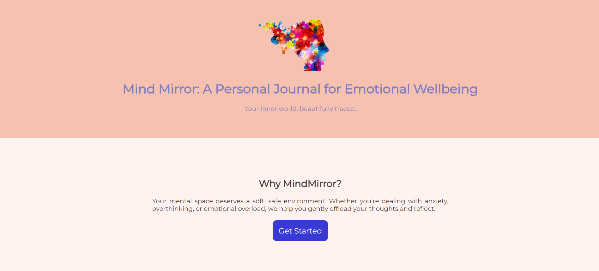
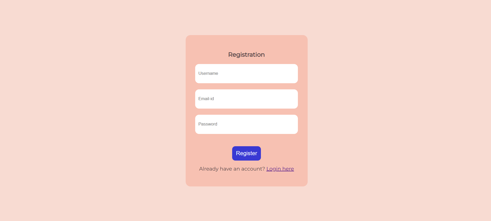
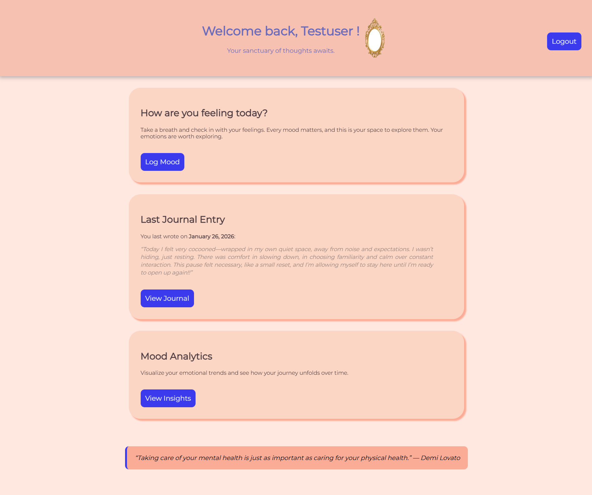
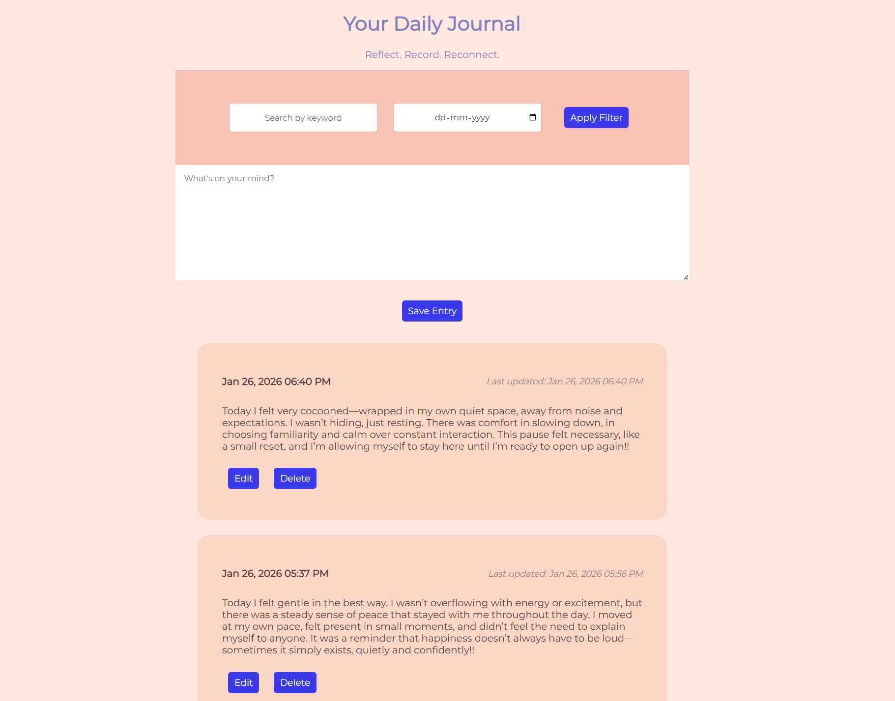
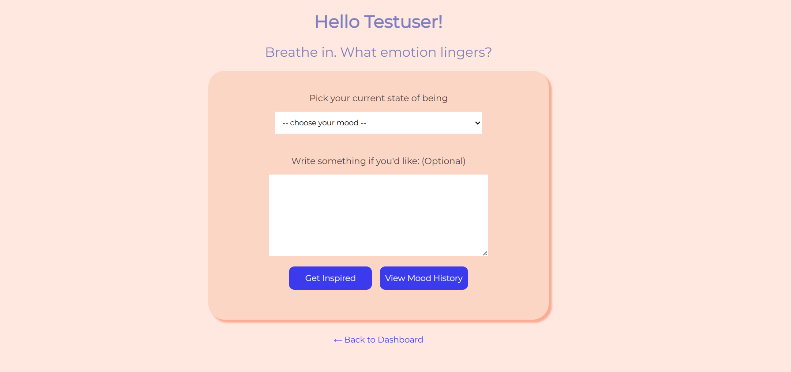
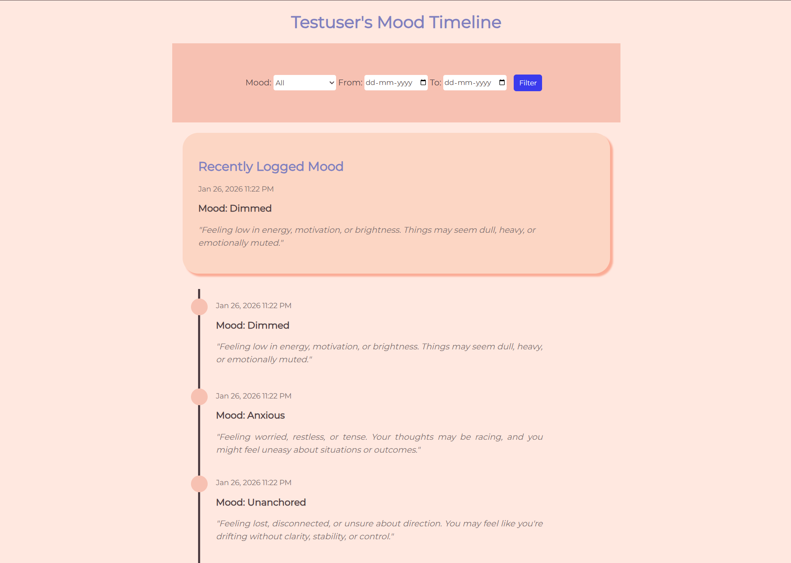
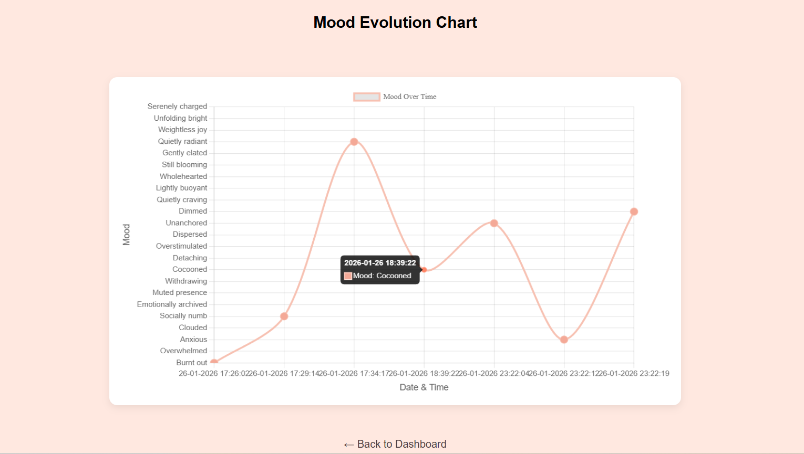

# MindMirror 🪞

MindMirror is a personal journaling web application designed to support emotional wellbeing. It helps users reflect on their thoughts, track moods, and gain insights into their emotional patterns through visual analytics.

## ✨ Features
- Mood tracking to record daily emotions  
- Reflective journaling in a private space  
- Personalized, mood-based quotes  
- Interactive mood analytics using Chart.js  
- Secure user authentication  

## 🛠 Tech Stack
- Frontend: HTML, CSS, JavaScript, Bootstrap  
- Backend: PHP, MySQL  
- Data Visualization: Chart.js  

## 📸 Screenshots

### Home

### Register/Login

### Dashboard

### Journaling

### Mood Selection

### Mood History

### Mood Analytics

## 🚀 Live Demo
🔗 https://phpdomain.infy.uk

## 📌 About the Project
This project was built after completing my 4th-semester IP paper and helped strengthen my fundamentals in web development, authentication, database management, and UI design. The strong foundation gained here later enabled me to confidently build full MERN stack applications.
